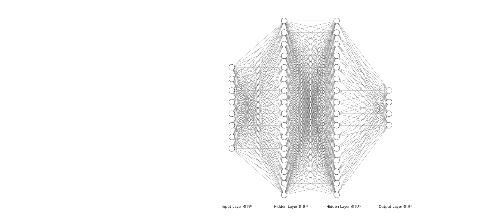
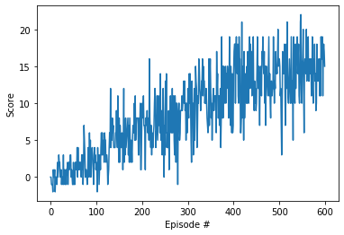

[](https://pytorch.org)
[]()

[//]: # (Image References)

[image1]: https://user-images.githubusercontent.com/10624937/42135619-d90f2f28-7d12-11e8-8823-82b970a54d7e.gif "Trained Agent"

# Reinforcement-learning-unity-banana


### Introduction

This is a reinforcement learning project in unity ml-agents environment. An agent is trained to navigate (and collect bananas!) in a large, square world.  

![Trained Agent][image1]

A reward of +1 is provided for collecting a yellow banana, and a reward of -1 is provided for collecting a blue banana.  Thus, the goal of your agent is to collect as many yellow bananas as possible while avoiding blue bananas.  

The state space has 37 dimensions and contains the agent's velocity, along with ray-based perception of objects around agent's forward direction.  Given this information, the agent has to learn how to best select actions.  Four discrete actions are available, corresponding to:
- **`0`** - move forward.
- **`1`** - move backward.
- **`2`** - turn left.
- **`3`** - turn right.

This repository is also a project of Udacity's [Deep Reinforcement Learning Nanodegree](https://www.udacity.com/course/deep-reinforcement-learning-nanodegree--nd893) program, check out for more instructions there.  

### Installation

1. Download the environment from one of the links below.  You need only select the environment that matches your operating system:
    - Linux: [click here](https://s3-us-west-1.amazonaws.com/udacity-drlnd/P1/Banana/Banana_Linux.zip)
    - Mac OSX: [click here](https://s3-us-west-1.amazonaws.com/udacity-drlnd/P1/Banana/Banana.app.zip)
    - Windows (32-bit): [click here](https://s3-us-west-1.amazonaws.com/udacity-drlnd/P1/Banana/Banana_Windows_x86.zip)
    - Windows (64-bit): [click here](https://s3-us-west-1.amazonaws.com/udacity-drlnd/P1/Banana/Banana_Windows_x86_64.zip)
    
2. Place the file under root folder of the repository, and unzip (or decompress) the file. 

3. Install [Anaconda](https://www.anaconda.com/)

4. Run code in anaconda prompt to setup python environment
```
conda env create -f environment.yaml
```

### Run the exercise

- Activate ml-agents environment with code
```
activate ml-agents
```
- There're several instructions notebook under `/report`. Open 
`Navigation.ipynb` to get started with training agent step by step! 
Open `Report.ipynb` to read details for design and implementations.
To open these instructions, get to repository folder and type in anaconda prompt:
```
jupyter notebook
```

- You can simply run `/dqn/navigation.py` to train.
```
python navigation.py
```
A Unity window will pop up and show the process of training. The score will prompt in console and trained model will be saved.

### Network and Hyperparameters

Neural network has an input size of 37 and hidden layers size of 64 and output size of 4.




Other hyperparameters:
```python
BUFFER_SIZE = int(1e5)  # replay buffer size
BATCH_SIZE = 64         # minibatch size
GAMMA = 0.99            # discount factor
TAU = 1e-3              # for soft update of target parameters
LR = 5e-4               # learning rate 
UPDATE_EVERY = 4        # how often to update the network
```

### Result

This agent collect an average of 13+ in 100 episodes and finish it in 600 epsiodes.

Episode 100	Average Score: 0.97

Episode 200	Average Score: 4.52

Episode 300	Average Score: 8.18

Episode 400	Average Score: 10.72

Episode 500	Average Score: 12.82

Episode 600	Average Score: 14.44

